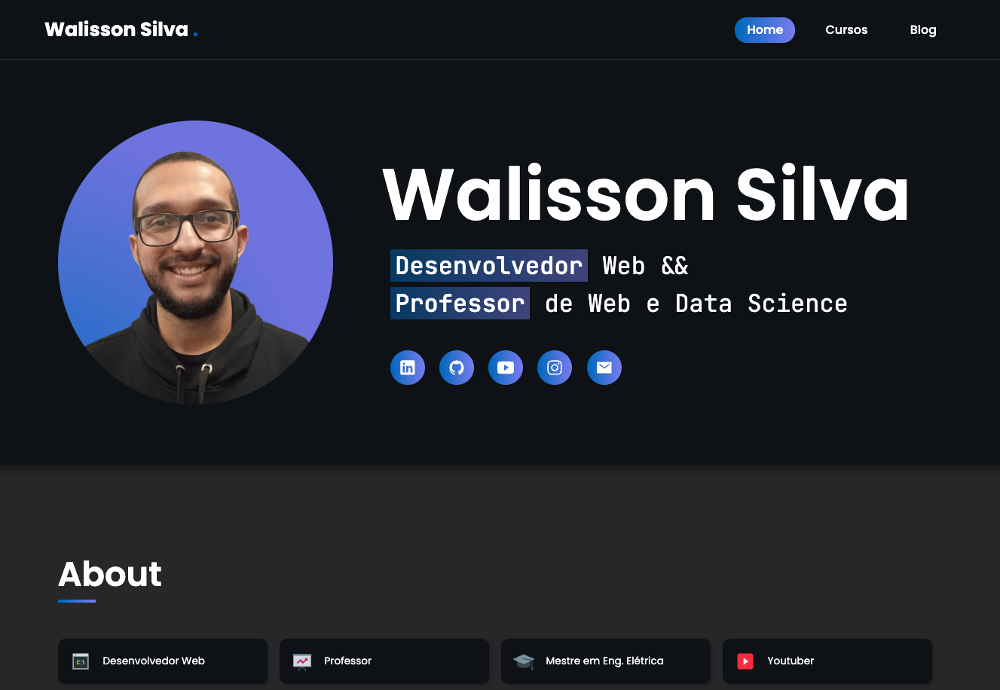
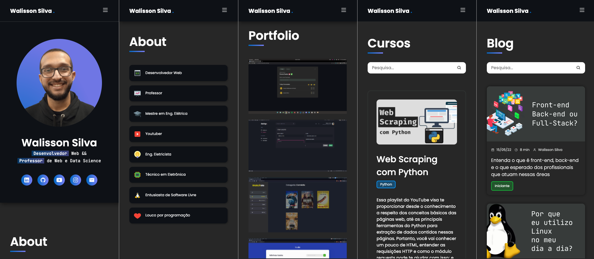

# Site Pessoal

### Versão Desktop 🖥



### Versão Mobile 📱



Esta aplicação consiste no meu site pessoal, desenvolvido com o Next.js, cujo o intuito é apresentar um pouco mais sobre mim, minhas skills, meus projetos, cursos e outros conteúdos que eu tenho o interesse que compartilhar na internet.

Além disso, o propósito do meu site é mostrar um pouco do meu trabalho, das minhas preferências, sendo todo o design de autoria própria.

Este projeto segue uma arquitetura Jamstack e, portanto, consiste apenas em um front-end, para o qual os dados são servidos por um CMS (Prismic CMS).

## Páginas da Aplicação

O site contém as seguintes páginas:

1. Home: A página inicial do site. Contém um banner principal com uma foto, breve descrição e links para minhas redes sociais. Em seguida, uma seção com mais informações sobre mim, seguida por uma seção que apresenta meus principais projetos. Por fim, a última seção corresponde ao Blog, contendo os seis últimos posts.
2. Cursos: Uma página listando cursos de autoria própria e disponíveis gratuitamente no YouTube.
3. Blog: Uma página listando todos os meus posts do blog, com a opção de pesquisar por uma palavra-chave.

## Como rodar a aplicação?

Primeiramente, é necessário ter o [Git](https://git-scm.com/downloads) e o [Node.js](https://nodejs.org/en/download/) instalados em sua máquina. Com isso, abra o seu Git Bash (Windows) ou Terminal (Linux/macOS) e digite o comando:

```
git clone https://github.com/walissonsilva/personal-website.git
```

Ao terminar o download do repositório, utilize o comando `cd personal-website` para acessar a pasta do projeto.

Por fim, execute o comando `npm install` para instalar todas as dependências do projeto e, em seguida, `npm run dev` para subir o servidor.

Feito isso, basta acessar `http://localhost:3000` no seu navegador para visualizar o projeto. 🚀

> Os projetos do portfólio, cursos e posts do Blog não deverão aparecer na página, pois você não terá as chaves de acesso à minha conta do Prismic; no entanto, o restante da página será renderizado normalmente.

## Tecnologias Utilizadas

A aplicação foi construída utilizando:

- [Next.js](https://nextjs.org/)
- [Styled-componentes](https://styled-components.com/) para a criação de componentes estilizados
- [Prismic CMS](https://prismic.io/) para a obtenção dos dados de portfólio, cursos e blog
- [React Icons](https://react-icons.github.io/react-icons/) para os ícones
- [TypeScript](https://www.typescriptlang.org/) para a tipagem estática do JS e evitar erros no desenvolvimento

## Extras

### Paleta de cores da Aplicação


Você também pode acessar a paleta de cores por meio [deste link](https://coolors.co/0267c1-787ff6-d3d5d4-383d3b-0e1116). Se preferir, acesse o arquivo `src/styles/themes/dark.ts` para visualizar as cores e outros estilos padrões do projeto.
